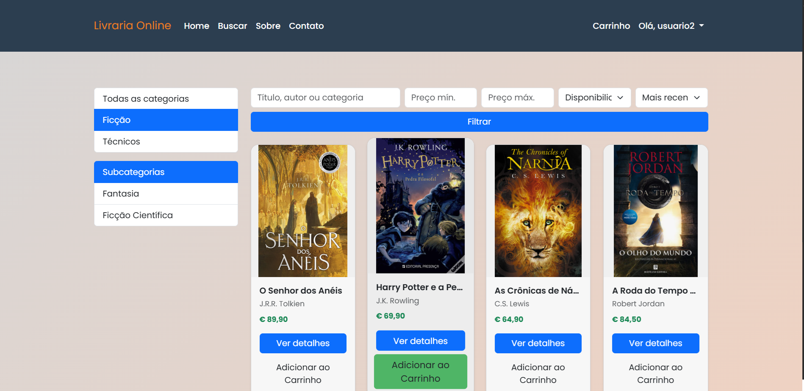
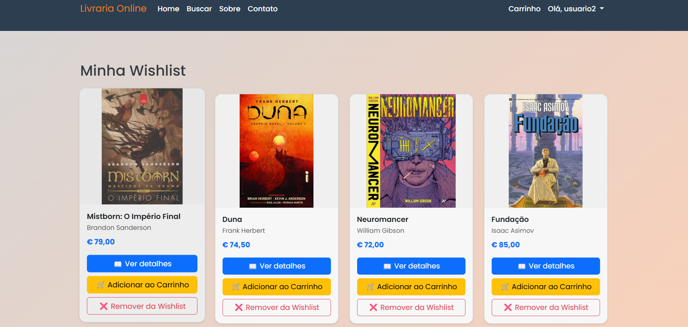

# 📚 Livraria Ramos - Projeto Web PHP/MySQL


Um sistema de **loja online de livros** desenvolvido em **PHP, MySQL, HTML, CSS e JavaScript**, com painel de administração, funcionalidades de wishlist, carrinho de compras, avaliações de usuários e filtros avançados de busca.

Este projeto foi desenvolvido como **prática de programação web full-stack** e inclui todas as funcionalidades essenciais de uma livraria online moderna.

---

## 💻 Tecnologias Utilizadas

* **Frontend:** HTML5, CSS3, Bootstrap 5, JavaScript, jQuery
* **Backend:** PHP 8.x
* **Banco de Dados:** MySQL / MariaDB
* **Outros:** FontAwesome, ícones Bootstrap, animações e efeitos hover

---

## ⚙️ Funcionalidades

### Funcionalidades principais para o usuário:

1. **Cadastro e login de usuários** com sessões seguras.
2. **Página inicial dinâmica** com banners/carrossel e cards de produtos.
3. **Filtro por categorias e pesquisa por livros**.
4. **Wishlist de favoritos**, com adição e remoção de livros.
5. **Carrinho de compras funcional**, com botão de adicionar ao carrinho em todos os cards e detalhes do livro.
6. **Página de detalhes do livro** com:

   * Informações do livro (título, autor, categoria, preço)
   * Botões para adicionar à wishlist e ao carrinho
   * Avaliações de usuários e média de avaliação
   * Formulário de avaliação para usuários logados
7. **Sistema de avaliação de livros** com estrelas e comentários.
8. **Design responsivo** compatível com desktops, tablets e smartphones.
9. **Paginação de livros** e navegação intuitiva entre páginas.
10. **Visual moderno** com efeitos de hover, cores suaves e mini texturas nos cards.

### Funcionalidades administrativas (opcionais / futuras implementações):

* Cadastro de novos livros e categorias.
* Edição e remoção de produtos.
* Visualização e moderação de avaliações.

---

## 🗂 Estrutura do Projeto

```
livraria-ramos/
│
├─ assets/
│   ├─ css/             # Estilos customizados
│   ├─ images/          # Imagens de livros, banners, logos
│   └─ js/              # Scripts JS / jQuery
│
├─ includes/
│   ├─ auth.php         # Funções de autenticação
│   ├─ config.php       # Configurações gerais do projeto
│   ├─ db.php           # Conexão com o banco de dados
│   ├─ footer.php       # Footer comum
│   └─ header.php       # Header comum
│
├─ pages/
│   ├─ book_details.php
│   ├─ home.php
│   ├─ login.php
│   ├─ wishlist.php
│   └─ add-review.php
│
├─ ajax/
│   └─ toggle_wishlist.php
│
└─ README.md
```

---

## 🛠 Instalação

1. Clone o repositório:

```bash
git clone https://github.com/srloga/livraria-ramos.git
```

2. Configure o banco de dados MySQL:

```sql
CREATE DATABASE livraria_ramos;
USE livraria_ramos;

-- Importe o arquivo SQL fornecido 
```

3. Configure o arquivo `includes/config.php`:

```php
define('BASE_URL', 'http://localhost/livraria-ramos/');
define('DB_HOST', 'localhost');
define('DB_NAME', 'livraria_ramos');
define('DB_USER', 'root');
define('DB_PASS', '');
```

4. Abra no navegador:

```
http://localhost/livraria-ramos/pages/home.php
```

---

## 🎨 Layout e Design

* Cards com **cores suaves**, **gradientes e mini texturas** leves.
* Botões com **hover animado** (favoritos, adicionar ao carrinho, enviar avaliação).
* Layout **responsivo**, compatível com dispositivos móveis e desktops.
* **Animações discretas** para imagens e cards (fade-in, hover effects).

---

## 📂 Funcionalidades Extras

* **Mini-texturas nos cards** para um visual sofisticado.
* **Ícones com emojis e FontAwesome** para botões de ação.
* **Mensagens de confirmação** ao remover livros da wishlist.
* **Tratamento de imagens faltantes** com placeholder automático.
* **Paginação dinâmica** para grandes listas de livros.

---

## 📷 Screenshots


*Página inicial com carrossel e cards de livros.*


*Wishlist com botões de remover e adicionar ao carrinho.*


*Detalhes do livro com avaliação e botões de ação.*

---

## 🤝 Contribuição

1. Fork o projeto.
2. Crie uma branch: `git checkout -b minha-feature`.
3. Commit suas alterações: `git commit -am 'Adicionei uma feature'`.
4. Push para a branch: `git push origin minha-feature`.
5. Abra um Pull Request.

---

## 📝 Licença

Este projeto está sob a licença **MIT**. Veja o arquivo [LICENSE](LICENSE) para mais detalhes.
